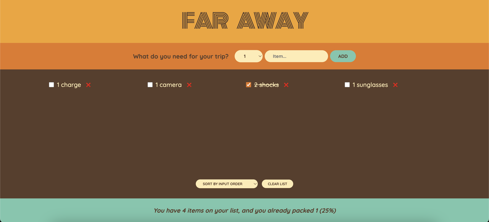

# Travel packing list - build with React

This is a exercise to build packing list with React. The user can add item to the list, delete item and check the travel list if its packed.

- Screenshot:
  

## Built with

- React

## Runs the app

```Shell
npm start
```

- Runs the app in the development mode.
- Open [http://localhost:3000](http://localhost:3000) to view it in your browser.

- The page will reload when you make changes.
- You may also see any lint errors in the console.

## Links

- Live Site URL: [live site URL here]()

## Author

- The Ultimate React Course 2024: React, Redux & More by Jonas Schmedtmann
- My GitHub - [YACodingroom](https://github.com/YAcodingroom)

## Acknowledgments

- Ivy & Ciao
- YAL me
- Dr.Angela & Jonas
